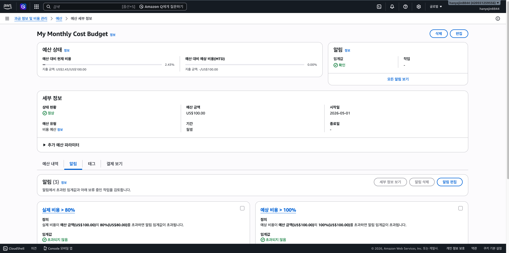

# CH4 AWS Cloud Assignment

## 진행 단계
- LV0 Budget 설정 완료
- LV1 로컬 Member API 구현 완료

## LV0 Budget
- 월 예산: $100
- 알림 기준: 80%

## LV1 Local API
- POST /api/members
- GET /api/members/{id}
- GET /actuator/health
- local profile: H2
- prod profile: MySQL